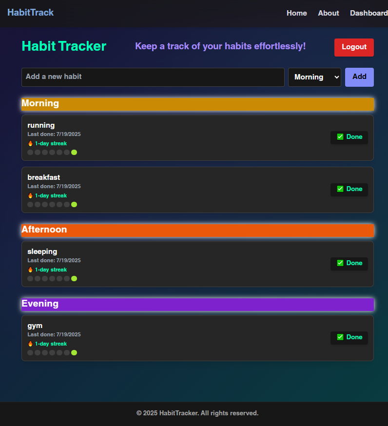
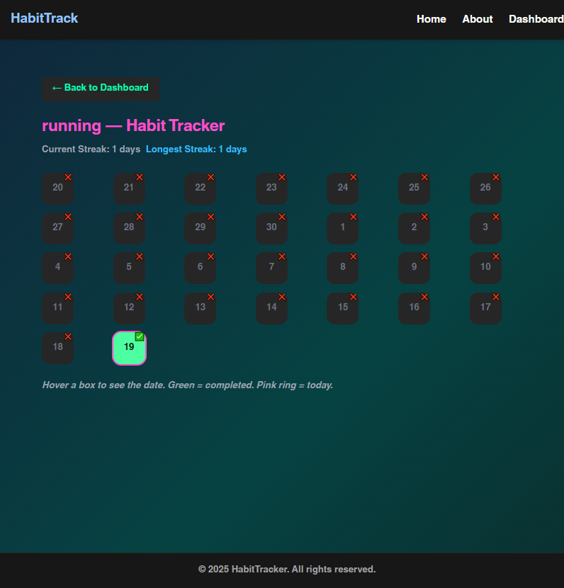
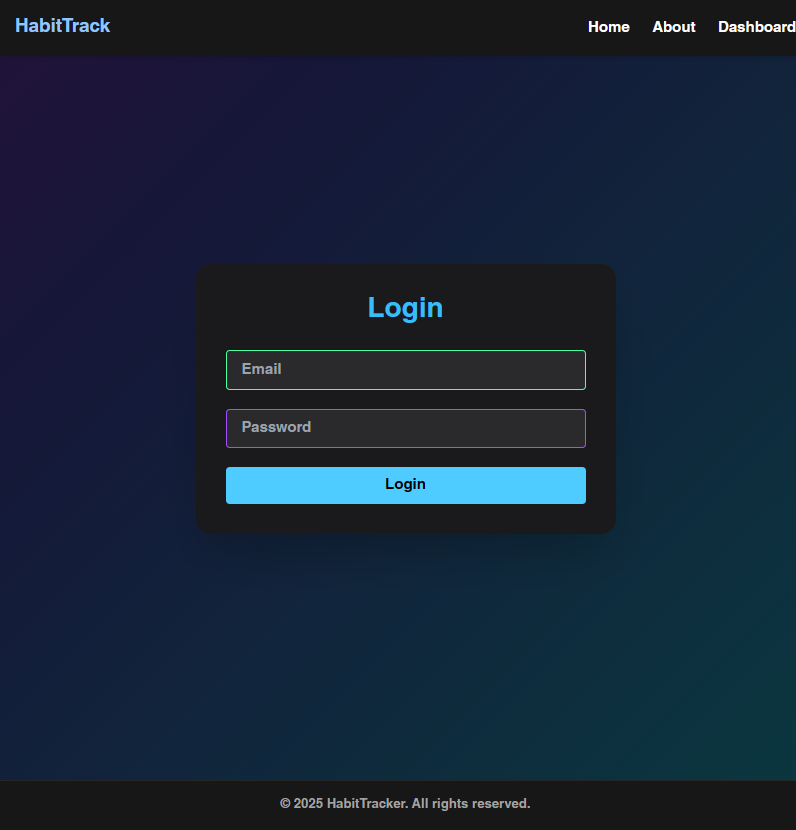

# 🌟 Habit Track — A Neon-Powered MERN Habit Tracker

Welcome to Habit Track — a sleek, glowing, and intuitive habit tracking app built with the MERN stack. Track your daily routines, build consistent streaks, and stay motivated with an immersive neon-themed UI.



---

## 🚀 Features

- 🔐 Secure JWT-based authentication
- 📅 Create habits grouped by time of day (Morning, Afternoon, Evening, Night)
- 📈 Visual streak tracking with animated calendar heatmaps
- ✅ Mark habits as done for the day
- 🌈 Neon-dark theme with glowing cards and UI animations
- 🧠 Frontend built with Vite + React + TailwindCSS v4

---

## 📸 Screenshots

## 📸 Screenshots

- Dashboard view  
  

- Habit calendar heatmap  
  

- Login form  
  

- Registration form  
  

---

## 🛠️ Tech Stack

- Frontend: React, Tailwind CSS v4, Vite
- Backend: Express.js, Node.js, MongoDB, Mongoose
- Auth: JWT (JSON Web Tokens)
- Hosting (optional): Vercel (Frontend), Render/Atlas (Backend & DB)

---

## 🧪 Running Locally

1. Clone the repository

   ```bash
   git clone https://github.com/Deep2915/habit-tracker.git
   cd habit-tracker

   ```

2. Install dependencies for both frontend and backend

   ```bash
   cd client && npm install
   cd ../server && npm install
   ```

3. Add environment variables in .env inside /server

   ```bash
   MONGO_URI=your_mongodb_connection
   JWT_SECRET=your_jwt_secret
   ```

4. Start the development servers

   # In one terminal:

   ```bash
   cd server
   node server.js
   ```

   # In another terminal:

   ```bash
   cd client
   npm run dev
   ```

🧑‍🎨 Author
Designed & developed by Deep Inderpal Kaur

📌 License
This project is licensed under the MIT License.

```

```
